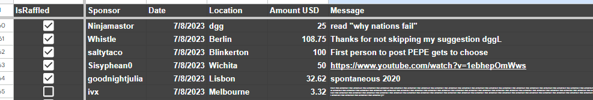
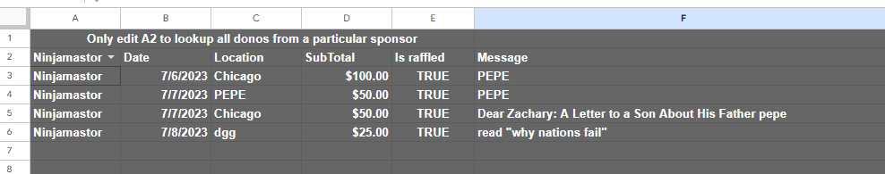
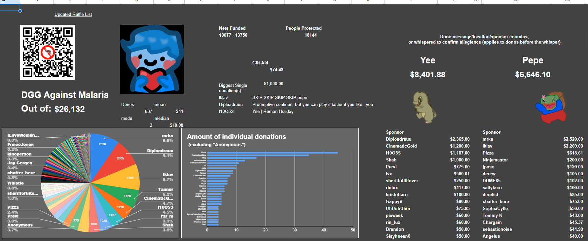
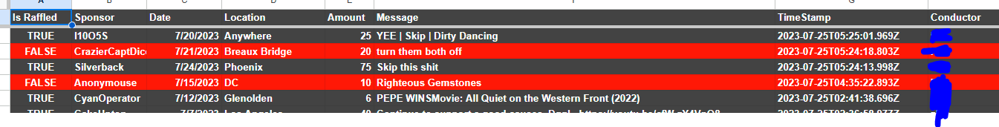

# Admin Instructions

Administrate user access in this [sheet](https://docs.google.com/spreadsheets/d/1V9pGL5OZhSn63tPSgsfzRuz_C-2mquLnGyi2IS4BT2M/edit#gid=0) (requires access)

Should be pretty self explanatory.
The backend will only check against avaiable `AccessCodes` which are toggled as `IsActive`. When manipulating the `Proccessed` sheet in the DB it will also use the `Alias` field when signing with a timestamp.

If anything is rolled but not removed from the raffle, or something needs to be added again to the raffle, use the `IsRaffled` in the `Proccessed` sheet to toggle this. Do not manipulate anything else in the `Proccessed` sheet.

If you want to add a `yee` or `pepe` tag to donations so they are counted in the stats, or otherwise manipulate the DB, it is possible in the `Raw Data` sheet. Keep in mind there is no validion any entry might break the rest of the system. (To add tags simply adding a ` yee` or ` pepe` to the message field is enough)

**Note** keep in mind the scraper updates and overwrites the last 20 entries for every scrape, if last 20 entries need to be changed one would have to wait until new entries are scraped. This is due to recent donations not having full info which needs to be updated later.

The `Lookup` sheet can be used to view donations made in a specific sponsor name.

The `SortByRaffleTime` and the `APICalls` sheet are used for the unauthorized API lookups.

The `AllSortByRaffle` sheet can be used to verify last rolls, anytime the api is used to roll a timestamp will be logged with alias, if the entry is not removed from the raffle it will appear red and the `IsRaffled` field will be set to false.

# Stills from Spread Sheets

