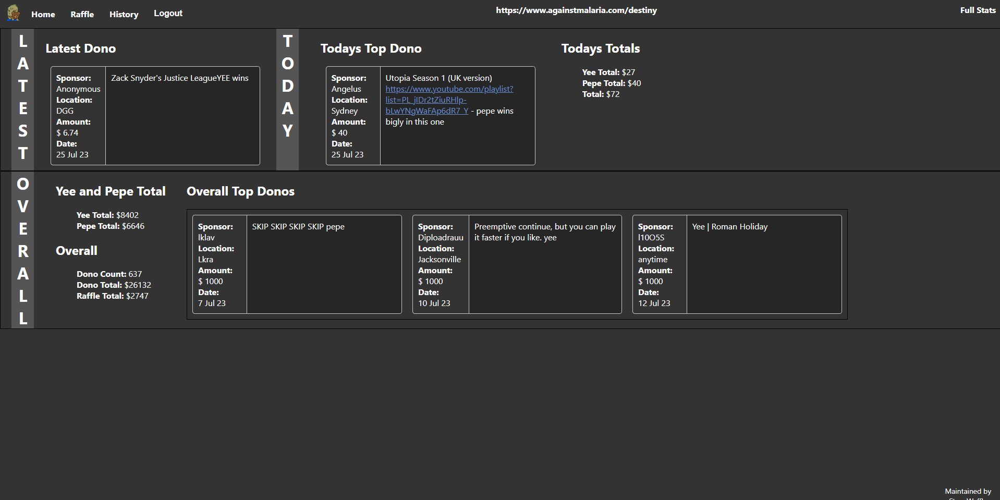

# Operator Instructions

Access the web app from the url provided by an Admin.

Login to website using `AccessCode` provided by Admin.

The Scraper runs every fifteen minutes`[hh:00,hh:15,hh:30,hh:45]`, if needed a manual scrape can be initiated with the scrape button on the `/raffle` page. The scrape is rate limited, no need to hit it to often.

Hit the `Raffle` button do open the raffle modal, `doRaffleRoll` will initate a raffle roll. Hit the `Remove from Raffle` button when finished displaying the entry. If you need to see the information again, simply access the `/history` page to see reverse chronological list of raffle entries.

**note** Make sure to remove rolled raffle entries, if something is done by mistake contact admin to sort out the entry.

#### Suggested skip price

This appears as entry are rolled. it is currently set to `Max(donoamount+15, f(currentAmountOfDonosInRafflePool))`
So either the current rolled donoamount or the result of a function, whichever is higher.
The function gives higher values if there are not many donos left and lower values if there are many dono's currently in the pool.

Currently set to `f(x) = 20+((250-20)/1.01^x` Here is how it plays out at different x values


With a dono pool of around 300, it's at around $32 , at 200 it would be around $50

## OBS overlays

If you want to display info from api you can use the below html files to get started.
After saving the files to `.html` adding these to OBS is simply adding it to scene as a browser toggling `local file` and adding the file. Can be practical mark as `unload if hidden` so you get recent info whenever changing scenes etc.
Documentation for which endpoints are available is documented in [this postman documentation](https://documenter.getpostman.com/view/10136250/2s946fdCHd#e7d73800-9636-4216-a5c5-612e858d72af). Everything is delivered as JSON payloads.

**note** replace `example.com` with url from admin, remember to use the `/api` route to access API.

### Example overlays

Get Latest entry

```html
<!DOCTYPE html>
<html>
  <head>
    <title>Dynamic Content Update</title>
    <style>
      p1 {
        font-family: Roboto, Helvetica Neue, sans-serif;
        color: #b3b3b3;
      }
    </style>
  </head>
  <body>
    <p1 id="content">loading</p1>

    <script>
      // Function to update the content
      function updateContent() {
        // Fetch the latest content from the API
        fetch("example.com/api/latest")
          .then((response) => response.json())
          .then((data) => {
            // Update the content of the <p1> element

            document.getElementById(
              "content"
            ).innerHTML = `$${data.amount} | ${data.sponsor}: ${data.message}`;
          })
          .catch((error) => {
            console.error("Error:", error);
            document.getElementById("content").innerHTML = "error";
          });
      }

      // Call the updateContent function initially
      updateContent();

      // Schedule content update every 5 minutes
      setInterval(updateContent, 5 * 60 * 1000);
    </script>
  </body>
</html>
```

Get Latest entry - scrolling over scene

```html
<!DOCTYPE html>
<html>
  <head>
    <title>Dynamic Content Update</title>
    <style>
      .content {
        font-family: Roboto, Helvetica Neue, sans-serif;
        color: #b3b3b3;
        font-weight: bold;
        white-space: nowrap;
        overflow: visible;
        width: 100%;
        display: inline-block;
        animation: slideRightToLeft 60s linear infinite;
      }

      @keyframes slideRightToLeft {
        0% {
          transform: translateX(200%);
        }
        20% {
          transform: translateX(100%);
        }
        45%,
        55% {
          transform: translateX(0%);
        }
        80% {
          transform: translateX(-100%);
        }
        100% {
          transform: translateX(-200%);
        }
      }
    </style>
  </head>
  <body>
    <span id="content" class="content"></span>

    <script>
      // Function to update the content
      function updateContent() {
        // Fetch the latest content from the API
        fetch("example.com/api/latest")
          .then((response) => response.json())
          .then((data) => {
            // Update the content of the <p1> element

            document.getElementById(
              "content"
            ).innerHTML = `$${data.amount} | ${data.sponsor}: ${data.message}`;
          })
          .catch((error) => {
            console.error("Error:", error);
            document.getElementById("content").innerHTML = "error";
          });
      }

      // Call the updateContent function initially
      updateContent();

      // Schedule content update every 5 minutes
      setInterval(updateContent, 5 * 60 * 1000);
    </script>
  </body>
</html>
```

# Stills from Web App




